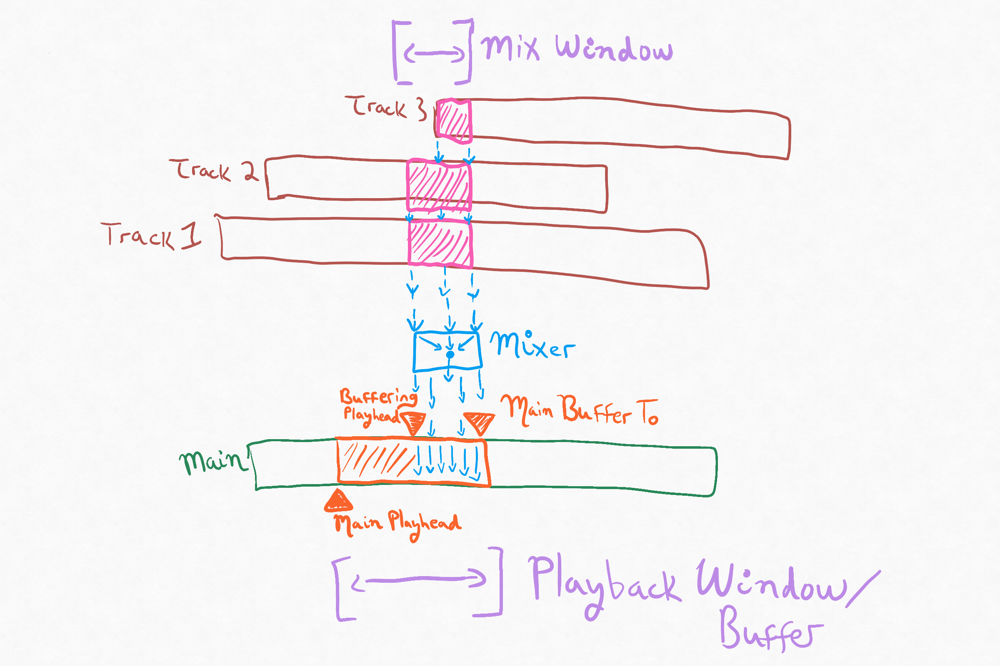

# VideoDecodeEncodeDemo

## This is not an officially supported Google product
This is a proof-of-concept demo. This code should not be used in production.

## About
The aim of this project is to:
 * Demonstrate a workaround for the "frame-dropping problem" (see below)
 * Demonstrate synchronizing playback of multiple video tracks using a single main audio track
 * Provide proof-of-concept code showing that the Android APIs provide building blocks that can be
 used for performant video transcoding
 
The demo app decodes 4, 30-second 1080p video streams without frame-dropping via a 
SurfaceTexture. A simple GL filter (Sepia) is provided as well as sample export/encoding code. 

Note: to download the included media files, please install [git-lfs](https://git-lfs.github.com/).

## Details
### The "Frame Dropping Problem"
The fastest way to decode media using MediaCodec is via an internal Surface. MediaCodec was
optimized for real-time media playback - in order to prevent wasting system resources by decoding
frames that would be thrown away or replaced before being displayed, logic was put in place to 
discard frames entering the Surface decode queue that were arriving faster than they could be shown.
This logic is not controllable or visible before Android 10 (Q) when the 
[allow-frame-drop](https://developer.android.com/reference/android/media/MediaCodec#using-an-output-surface)
flag was introduced.

This works for the majority of media decoding cases and offers performance boosts and battery
savings. However, for video transcoding/editing use-cases, this either limits the decoding speed to
the device's refresh rate, or means frames will be lost. This can result in incorrect encodes,
synchronization issues between tracks, and glitches in effects and transitions.

This project demonstrates how to use internal Surface callbacks and an
[atomic lock](https://developer.android.com/reference/java/util/concurrent/atomic/AtomicBoolean)
to provide fast decoding using a SurfaceTexture, without frame dropping.

### ExoPlayer
[ExoPlayer](https://exoplayer.dev/) simplifies media decoding on Android and is used in many
productions apps like YouTube. Especially, for playing back media in real-time, ExoPlayer hides most
of the complexities of Android media decoding.

For this demo, because it is necessary to monitor and control the decoding/encoding surfaces, the
ExoPlayer methods and classes are overridden extensively. However, ExoPlayer still offers some
advantages over using [MediaCodec](https://developer.android.com/reference/android/media/MediaCodec) directly:
 * Some of MediaCodec API complexity is still hidden by ExoPlayer despite the many overrides
 * ExoPlayer contains a number of device specific workarounds for buggy OEM implementations. It is
 convenient to rely on this maintained library for these workarounds rather than trying to
 re-implement them. FYI, They are mostly found in the [MediaCodecRenderer.java](https://github.com/google/ExoPlayer/blob/release-v2/library/core/src/main/java/com/google/android/exoplayer2/mediacodec/MediaCodecRenderer.java)
 file of the ExoPlayer library.
 
MediaCodec/[MediaMuxer](https://developer.android.com/reference/android/media/MediaMuxer) is used for encoding.

### OpenGL Filter
A simple OpenGL sepia filter is included to demonstrate where to custom filters could be inserted
into the pipeline.

## Overview/Approach
To prevent frame dropping, an [atomic lock](https://developer.android.com/reference/java/util/concurrent/atomic/AtomicBoolean)
is used to ensure the decode renderer input queue is not over-filled. To keep track of this lock,
and the overall status of the decode/render/encoding processes, a `Frame Ledger` is used (think of
it as an accounting book). The ledger is also used to keep track of presentation timestamps to
ensure accurate encoding times for variable rate media.

Steps in the decode/render/encode process:

1. Engage the atomic lock before render. The demo overrides the `onVideoFrameAboutToBeRendered` callback of
ExoPlayer's `VideoFrameMetadataListener` (find this override in `FrameLedger.kt`). This will be
called after decoding and right before a frame is sent to the renderer. If another frame arrives
in the meantime - in `processOutputBuffer` of `VideoMediaCodecVideoRenderer.kt` - it is not
processed until the lock is released. The correct presentation time for this frame is recorded in
both the decode and encode hashmaps.

2. Frame is rendered to `InternalSurfaceTexture`. When the surface texture gets a new frame,
`onFrameAvailable` is called. `updateTexImage` is called on a separate thread. The `onFrameAvailable`
callback is triggered.

3. Initiate preview/encode rendering and release lock. `InternalSurfaceTextureRenderer` handles the
choreography between the `InternalSurfaceTexture` and the rest of the system. When `onFrameAvailable` 
is called, the atomic render lock is released. If this frame is required for the preview, a draw call is
requested. If this stream should is being encoded, this frame is passed to the encoder.

4. Preview frames. The demo offers a variable rate of preview frames. If a particular frame is
required to be drawn on the screen, a call to the `DrawFrameProcessor` is called. This is an OpenGL
shader that copies the image from the renderer output, applies a GL filter if necessary, and shows it
on the output surface. 

5. Encode frames. If a frame is intended for encode, a separate `DrawFrameProcessor` from the
preview case is called, rendering the frame to the input surface of the MediaCodec encoder. The
encoding logic is contained within `VideoEncoder.kt` and is a relatively straight-forward use
of [MediaMuxer](https://developer.android.com/reference/android/media/MediaMuxer), excepting the
caveats below.

6. Audio. Audio tracks are always decoded and will be encoded along with video if encoding is
selected. Audio can optionally be played out during decoding. See Audio Mixing below.

For detailed architecture notes and diagrams, see [Architecture.md](docs/Architecture.md).

### Notes/Caveats
 * Because decoding is done to a `SurfaceTexture`, the preview and export renders must take into the
 transform matrix of the `SurfaceTexture`, see [getTransformMatrix documentation](https://developer.android.com/reference/android/graphics/SurfaceTexture#getTransformMatrix(float%5B%5D)).
 Failure to do so will result in an "almost" correct image for 1080p media. However, there will be 
 an 8px "smeared" line of pixels due to 16-bit alignment requirements.
 * Many devices produce variable rate media. It is important to track the presentation time for each
 frame from the decoding step while the frame is being copied and passed from surface to surface -
 which do not intrinsically track this information -
 otherwise the media will be played/encoded at the incorrect rate, with slow-downs and speed-ups.
 Presentation times in the demo are stored in the `VideoFrameLedger`.
 * Because the demo decodes as fast as possible, the preview will not take into account variable
 rate media and just show the frames as fast as they are decoded/rendered.
 * Currently, the demo assumes that frames received from the renderer will be fed into and exit the
 encoder in the same order. Technically, this manifests into using a monotonic integer to count
 frames in the `encodeLedger` which requires the frame number (1, 2, 3, 4...) and the correct
 presentation time. Possibly a 3rd ledger should be made to record the surface time the frame
 entered the encoder and correlate that with the frame number for which it entered the encoder.
 Pratically, this does not appear to be necessary.
 * This has only been tested on a handful of phones and chromebooks.
 * Use this code at your own risk, it is intended as a proof-of-concept and for reference only.
 * 4 - 1080p mp4 files from a Pixel 4 phone are included for testing in the raw directory.
 * Encoded files are found in the sdcard/Android/data/dev.hadrosaur.videodecodeencodedemo directory.
 * Much logging code is intentionally left in the code. Uncommenting "viewModel.updateLog" lines
 will add logging to the in-app log area as well as the logcat messages.

## Audio mixing
If audio playback in enabled, all audio tracks will be mixed down to a single main [AudioTrack](https://developer.android.com/reference/android/media/AudioTrack).
The presentation time from this main audio track will drive the playback of all videos by syncing
with each track's MediaClock. On Android, if synchronized playback of multiple media files with
audio is desired, it is necessary to manually mix them down to a single source of truth.

### Audio mixing details
The `CopyAndPlayAudioSinks` for each media track will copy out audio buffers into an individual
`AudioMixTrack`. These will be mixed into a new `AudioMainTrack` that will be used for playback and
drive the decoding timeline. Audio playback speed (set to 1x in this demo) will therefore govern
video decode/playback speed. If audio is disabled, videos will decode as fast as possible.

The architecture of audio playback is made up of two sliding windows:
 1. A larger window ("Playback Window") for the main track corresponding to a circular array of
mixed audio samples that expects to be at least partially filled so that smooth audio playback can
proceed. As audio frames are played out, they are freed. The size of this array is bounded to
restrict memory use.
 2. A smaller window ("Mix Window") whose end is aligned with the end of the Playback Window. This
window is used to fill the Playback Window's array. As it moves forward, samples are mixed from all
tracks with audio in the Mix Window's timeframe. The mixed samples are copied into the playback
buffer.
 
In a multi-track audio/video editing situation, some tracks may not be aligned and/or contain silent
spaces, as shown in the following diagram. The Mixer should accommodate this. In this demo,
`AudioUtils::mixAudioByteBuffer` mixes an array of `AudioBuffers` into the main `AudioBuffer` based
on presentation times, while handling silences and different start times.

This demo assumes audio will be decoded into 16-bit PCM stereo samples at 48kHz.

## Usage
* Use the slider to set the frequency of preview frames to be shown (all the way to the left means
preview every frame, all the way to the right means only show 1 frame in 30
* Choose which of the 4 videos you wish to simultaneously decode
* Click `Decode` (or press 'd') to simultaneously decode all selected video streams
* Toggle the "Play Audio" control to turn on/off audio playback
* Toggle the sepia filter flag to engage a simple GL filter. These switch may be turned on and off 
during the decode/encode
* Turning on the "Encode 1st Stream" switch before beginning a decode will take the decoded frames
from the first media stream and re-encode it (with filter effects if selected)
* Preview rate has no effect on the encoding - all frames will always be encoded

## LICENSE
***

Copyright 2021 Google LLC

Licensed under the Apache License, Version 2.0 (the "License");
you may not use this file except in compliance with the License.
You may obtain a copy of the License at

    https://www.apache.org/licenses/LICENSE-2.0

Unless required by applicable law or agreed to in writing, software
distributed under the License is distributed on an "AS IS" BASIS,
WITHOUT WARRANTIES OR CONDITIONS OF ANY KIND, either express or implied.
See the License for the specific language governing permissions and
limitations under the License.